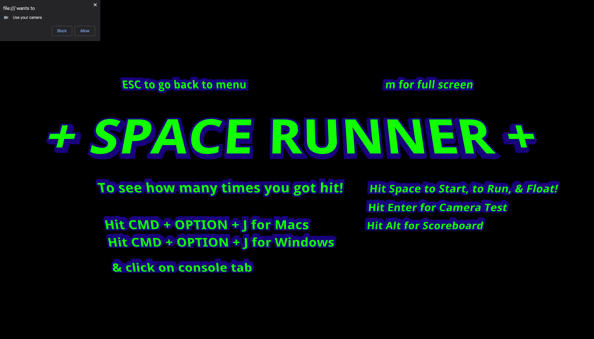
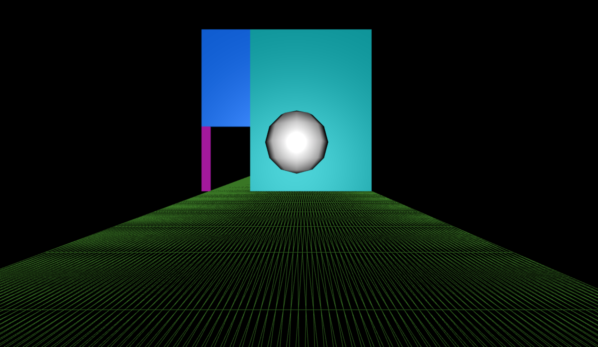

## To Run Application

FIRST PERSON ENDLESS RUNNER prototype w/ webcam motion capture Machine Learning

Tech Stack

three.js - design\
poseNet from ml5.js - real time motion capture

Integrated three.js stack for designing endless runner with random wall generation.
Manually implemented & calculated algorithms for collision detection.
Needs to work on potentially implementing a user friendly collision feedback mechanism.

1. git clone https://github.com/space-runner-prototype/space-runner.git in terminal
2. cd space-runner
3. npm i
4. npm run build
5. copy path of the index html onto your browser
